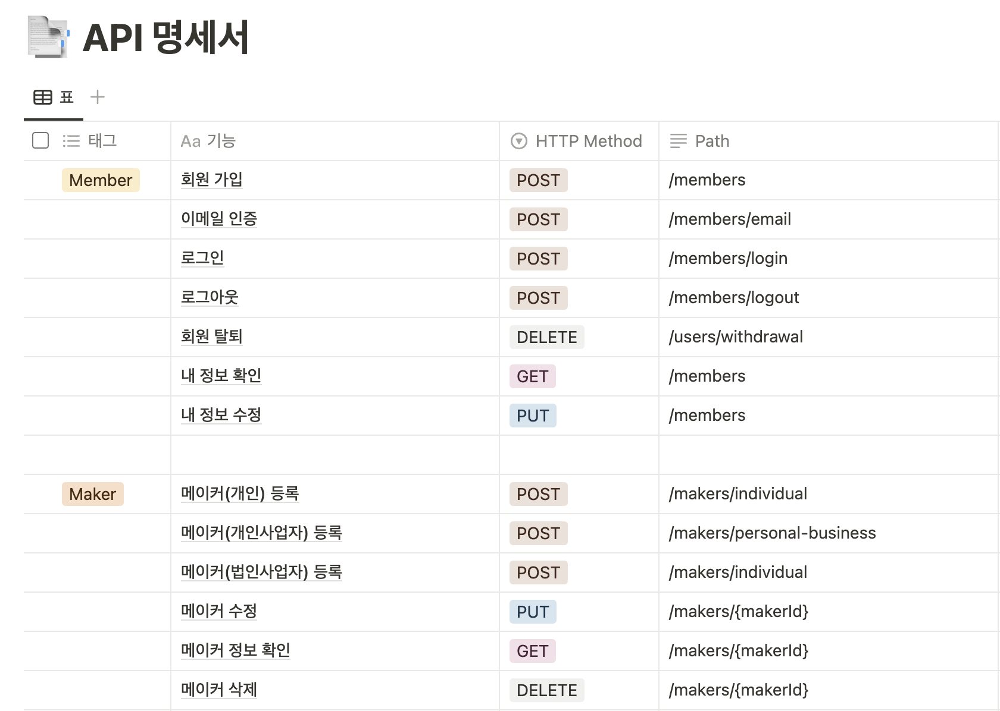
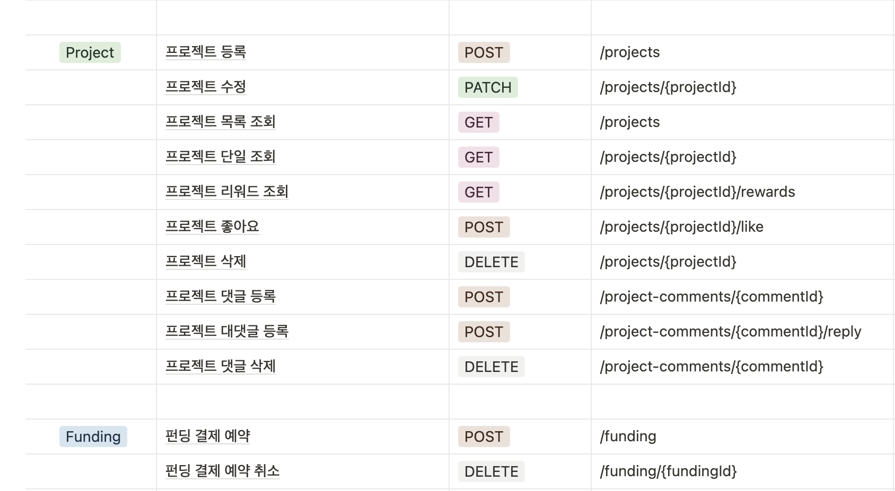
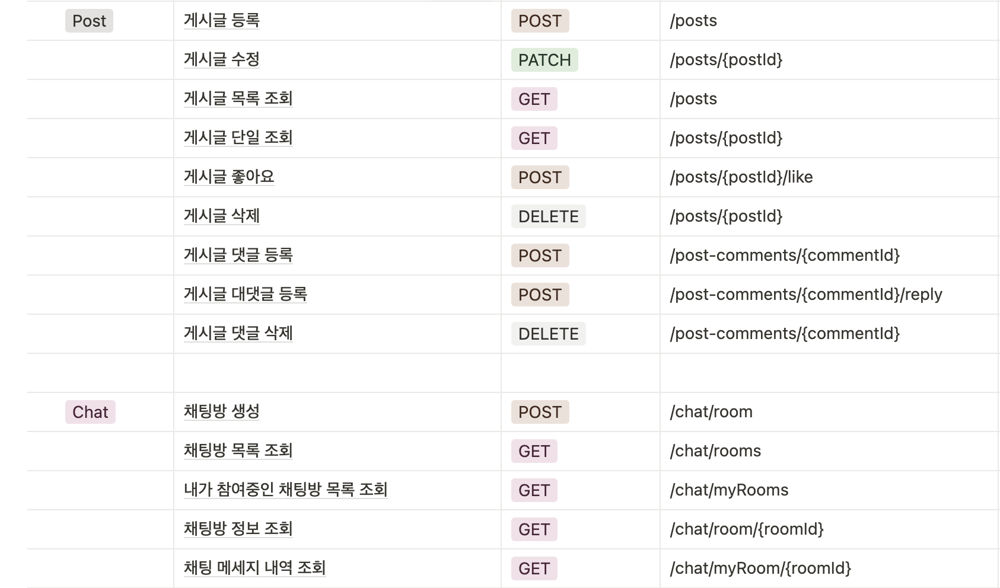
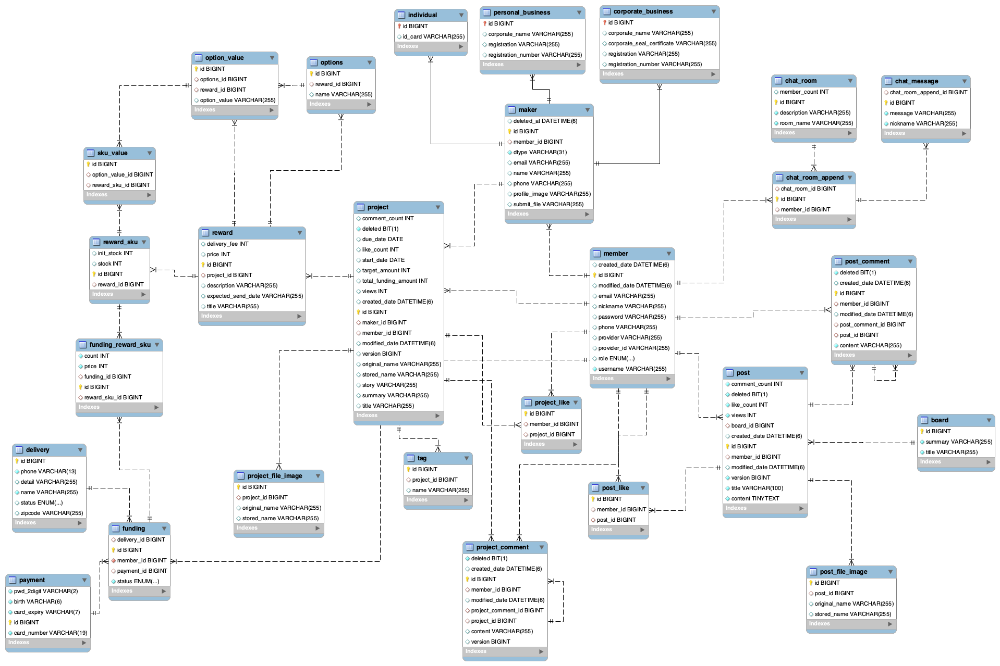
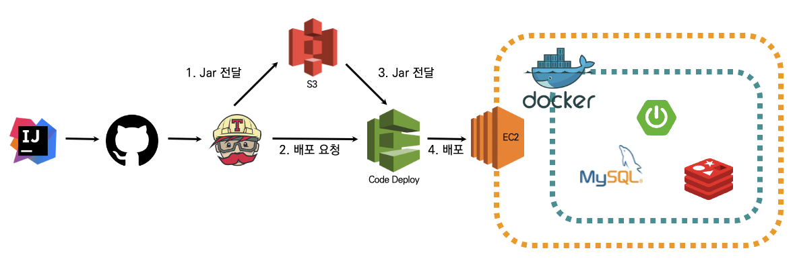

# UsEarth
멋쟁이사자처럼 최종프로젝트
> 환경과 관련된 게시글을 공유하고 사용자들과 채팅을 나눌 수 있고 환경을 생각하는 프로젝트를 만들어서 펀딩을 할 수 있는 플랫폼

## 개발 기간
2023.08.09 ~ 2023.09.14

# UsEarth 방문하기

[OAuth2.0 로그인](http://ec2-15-164-221-239.ap-northeast-2.compute.amazonaws.com:8080)

# 🧑🏻‍💻 개발자
| 팀장                      |             팀원              |             팀원              |               팀원               |
|:-----------------------:|:---------------------------:|:---------------------------:|:------------------------------:|
| 서재혁                     |             오창민             |             김소영             |              신은화               |
| https://github.com/twg0 | https://github.com/lou0124  | https://github.com/sy-k-98  | https://github.com/eunhwa0308  |

# 🎯 개발 환경
- Spring Boot `3.1.2`
- Language : `Java 17`
- Build : `Gradle`
- IDE : `IntelliJ`
- DB : `MySQL`, `Redis`, `H2`
- Test : `JUnit5`, `Swagger`, `PostMan`
- DevOps : `Github`, `AWS`, `Travis CI`
- Collaboration : `Slack`, `Jira`, `Notion`

# 💬 프로젝트 소개
## 주요 기능
### ✅ 사용자들은 소셜로그인, 일반 로그인을 통해 구분지어 질 수 있습니다.
### ✅ 사용자들은 게시판 기능을 통해 소통을 할 수 있습니다.
### ✅ 사용자들은 프로젝트를 등록, 후원을 하며 거래를 진행할 수 있습니다.
### ✅ 사용자들은 채팅기능을 통해 소통을 할 수 있습니다.

## 실행 방법
### 환경 설정
- Redis, Mysql 설치
- 환경 변수
  - UsEarthApplication의 Edit Configurations로 들어감
  - Modify Options의 Add VM Options 선택
  - VM Options에 "-DUS_EARTH_JASYPT=UsEarth5ISFive -DNAVER_ID={본인네이버아이디} -DNAVER_PW={본인네이버비밀번호}" 추가

## API 명세서

## ERD

## CI/CD 구조

# 기타
- [개발 과정 및 트러블 슈팅](https://github.com/Team-ISFive/UsEarth_ISFive/wiki)

